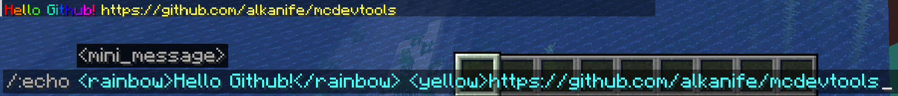
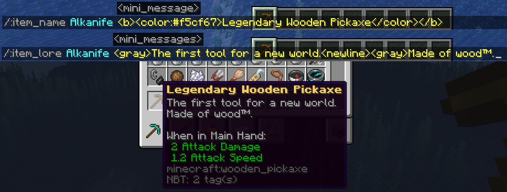
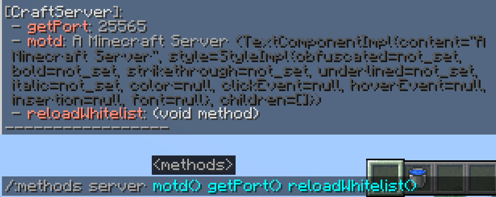
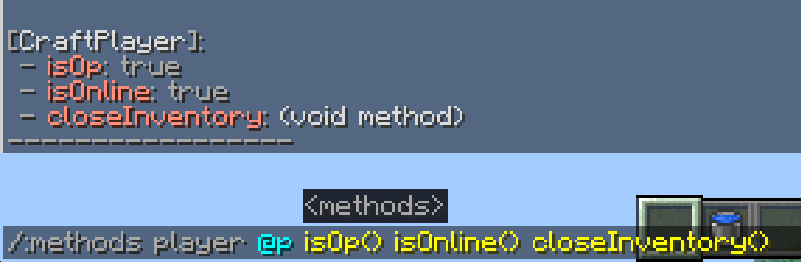

<h1 align="center">
  Minecraft devtools
   
  
  
  
  
</h1>

  <a href="#overview">Overview</a>
  •
  <a href="#commands">Commands</a>
  •
  <a href="#previews">Previews</a>
  •
  <a href="#license">License</a>

## Overview
This plugin mostly helps me to see how colored messages and items would render in Minecraft. It's particularly useful when creating custom inventories and Minecraft minigames. Over time I added a few other commands, see the complete list below.

A version for Minecraft 1.8 is still available under the name **mcdevtools-legacy**, but will not receive the 2.0.0 update. <a href="https://github.com/alkanife/mcdevtools/releases/tag/1.0.0">Latest 1.8-compatible version here</a>.

## Commands
If you are not familiar with the MiniMessage format, go to the documentation by <a href="https://docs.advntr.dev/minimessage/format.html">clicking here</a>.

Chat:
- `echo <value>`: Broadcasts input
- `clear_chat`: Clear chat by sending empty messages

Tablist:
- `tablist_header <value>`: Changes the player list header
- `tablist_footer <value>`: Changes the player list footer

Player:
- `player_fly [player]`: Toggle player flight

Player's name:
- `player_displayname <player> <value>`: Changes the player's display name
- `player_customname <player> <value>`: Changes the player's custom name
- `player_listname <player> <value>`: Changes the player's list name

Player's team:
- `player_team_prefix <player> <value>`: Changes the player's team prefix
- `player_team_suffix <player> <value>`: Changes the player's team suffix
- `player_team_color <player> <value>`: Changes the player's team color
- `player_leave_team <player>`: Make a player leave their team

If the player does not have a team, the command will create one.

Items:
- `item_name <player> <value>`: Changes the name of the item the player is holding
- `item_lore <player> <value>`: Changes the lore of the item the player is holding
- `item_lore_at <player> <line> <value>`: Changes the lore of the item the player is holding, specifying which line to change

For the lore, use `<newline>` to skip a line.

Entities:
- `entity_location <entities...> [format]`: Display entity location in a copy-pastable component. Lowercase x,y,z displays 3 digits after decimal points (0,000), and capital X,Y,Z only displays the number before the decimal point
- `armorstand_position [*|body|head|arms|legs]`: Display armor stand position & angles

Method:
- `methods server <methods...>`
- `methods entity <entity> <methods...>`
- `methods player <player> <methods...>`
- `methods world <world> <methods...>`

This command allows the executor to invoke a method of the selected entity/object
Exemple: /:methods player Alkanife getName()

## Previews
*Echo:*

*Item name & lore:*

*Methods:*

## Project dependencies
See [Maven Dependencies](https://github.com/alkanife/mcdevtools/blob/main/mcdevtools/pom.xml).

## License
Under the [MIT](https://github.com/alkanife/mcdevtools/blob/main/LICENSE) license.